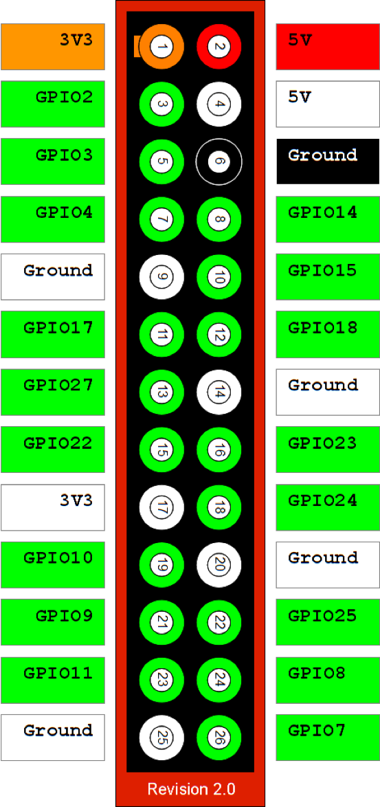

# Raspberry Pi

* 使用python RPi库的话，引脚定义与板上一致，即1～26

* python实例

```
import Rpi.GPIO as GPIO
GPIO.setmode(GPIO.BOARD) #如果设置GPIO.BCM则使用Board PIN编号
GPIO.setup(3,GPIO.OUT) #设置输出位，3即上图的GPIO2
GPIO.output(3,True)  # 输出引脚3逻辑高电平 3.3V
GPIO.output(3,False)  # 输出引脚3 逻辑低电平
```


LED接发，一头接300欧电阻接3.3V输出，即引脚1，一头接任意输出引脚，该引脚为True时无电势差（不亮），为False时有电势差（亮）

